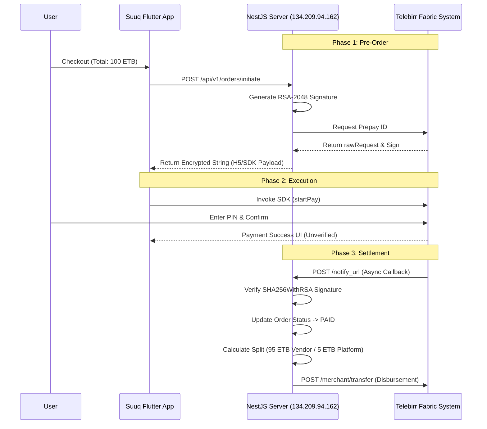

# Software Requirements Specification (SRS) & Technical Architecture

## Integration of Telebirr SuperApp SDK (In-App Payment)

**Project Name:** Suuq S - Multi-Vendor Marketplace  
**Document Version:** 1.0  
**Date:** January 26, 2026  
**Confidentiality Level:** Confidential / INSA Audit Review Only  
**Prepared For:** Information Network Security Administration (INSA), Ethiopia

---

## 1. Executive Summary

This document outlines the security architecture, data flow, and functional specifications for the integration of the Telebirr In-App Payment SDK within the "Suuq S" digital marketplace platform. It demonstrates compliance with financial security standards, focusing on the integrity of the **Merchant of Record** model where Suuq S acts as the primary payment acceptor before disbursing funds to sub-merchants (vendors).

## 2. System Architecture

### 2.1 Overview

The system operates on a Microservices-based architecture comprising three primary distinct entities:

1.  **Client Layer (Flutter Mobile App):** Determines user intent and interfaces with the Telebirr Android/iOS SDK. Protected via ProGuard obfuscation (`com.huawei.ethiopia.pay.sdk.api.core.**`).
2.  **Application Layer (NestJS Backend):** Acts as the secure orchestrator. It holds the RSA Private Keys, manages Fabric Tokens, and processes callbacks. Hosted at Static IP `134.209.94.162`.
3.  **Gateway Layer (Ethio Telecom Fabric):** The external payment processor handling the ledger and fund movements.

### 2.2 Component Diagram

Interaction logic utilizes a "Server-Signed, Client-Executed" pattern to prevent client-side tampering.

- **Fabric Token Service:** A dedicated backend service manages the lifecycle of the Telebirr access token, auto-refreshing it before expiration to prevent transaction failures.
- **Crypto Module:** Handles RSA-2048 encryption and SHA256WithRSA signing.

---

## 3. Data Flow Diagram (DFD)

### 3.1 Transaction Lifecycle

The transaction follows a strict **Asynchronous Verification** model. The mobile app is never trusted with payment confirmation; only the server-to-server callback validates a purchase.

#### Sequence:

1.  **Request Initialization:** User selects "Pay with Telebirr". Backend generates a signed `receiveCode` payload.
2.  **SDK Handoff:** App invokes Telebirr App via SDK using the signed payload.
3.  **Payment Execution:** User confirms PIN in Telebirr App.
4.  **Callback (Notify URL):** Telebirr server POSTs result to `https://api.suuq.ugasfuad.com/api/payments/telebirr-callback`.
5.  **Reconciliation & Disbursement:** Backend verifies signature, updates local ledger, and triggers 95/5 split via `/merchant/transfer`.

### 3.2 Mermaid.js Visualization

_(Copy the code below into a Mermaid-compatible viewer or VS Code Preview)_

---

## 4. Business Logic & Merchant of Record

### 4.1 Merchant of Record (MoR) Model

Suuq S acts as the single point of entry for funds to ensure compliance and trust.

- **Inflow:** 100% of the cart value is debited from the customer to the "Suuq S" Master Merchant Account.
- **Ledgering:** An internal immutable ledger (`telebirr_transaction` table) records the Fabric Reference ID against the local Order ID.
- **Outflow (Disbursement):** Upon successful callback verification, the system executes an automated B2B transfer to the Vendor's registered merchant ID for their share (95%), retaining the commission (5%).

### 4.2 Data Integrity

- **Anti-Tampering:** Order amounts are stored server-side. The client cannot modify the amount sent to Telebirr; the signature is generated on the backend using the stored database value.
- **Double-Spending Prevention:** The system enforces standard Idempotency keys based on `OrderId`. Duplicate callbacks for the same ID are logged but not re-processed.

---

## 5. Threat Model & Security Mitigations

### 5.1 Identified Threats

| Threat ID | Description                   | Severity | Mitigation Strategy                                                                                                              |
| :-------- | :---------------------------- | :------- | :------------------------------------------------------------------------------------------------------------------------------- |
| **TR-01** | **Replay Attacks**            | High     | Implementation of **Timestamp Nonce**. Requests outside a 60-second window (NTP Synced) are rejected by the Fabric Gateway.      |
| **TR-02** | **Man-in-the-Middle (MITM)**  | Critical | 1. Strict SSL/TLS enforcement.   2. **RSA-2048 Encryption** (PKCS1 Padding) for sensitive payload data.                       |
| **TR-03** | **Unauthorized Disbursement** | Critical | Disbursement API endpoints are firewalled and accessible only via internal logic triggers, not exposed to the public API client. |
| **TR-04** | **SDK Reverse Engineering**   | Medium   | **ProGuard Obfuscation** applied to `com.huawei.ethiopia.pay.sdk.api.core.**` to hide internal logic in the Android APK.         |
| **TR-05** | **Fake Callbacks**            | High     | All incoming callbacks to `notify_url` must pass **SHA256WithRSA** signature verification using the Telebirr Public Key.         |

### 5.2 Cryptographic Standards

- **Asymmetric Key:** RSA 2048-bit keys generated via OpenSSL.
- **Signature Algorithm:** `SHA256WithRSA`.
- **Payload Encryption:** AES / RSA hybrid approach where applicable (following Fabric V3 specs).

---

## 6. Functional & Non-Functional Requirements

### 6.1 Functional Requirements

1.  **FR-01:** The system must generate a unique `outTradeNo` for every transaction.
2.  **FR-02:** The system must verify the Fabric signature on the `notify_url` endpoint before updating order status.
3.  **FR-03:** The system must support manual reconciliation via the `queryOrder` interface if a callback is missed.

### 6.2 Non-Functional Requirements

1.  **NFR-01 (Uptime):** The Payment Gateway Service must maintain 99.9% availability.
2.  **NFR-02 (Latency):** Token generation and signing must complete within <200ms.
3.  **NFR-03 (Security):** Private keys must be stored in environment variables, never in source control.
4.  **NFR-04 (Traceability):** All financial API interactions must be logged with timestamp, IP, and Request ID (excluding sensitive PII/PINs).

---

## 7. Configuration Details (For Auditor Reference)

- **Environment:** Production
- **Backend Framework:** NestJS (Node.js)
- **Callback IP Allowlist:** Configured to accept specific Telebirr Gateway ranges (if applicable) or validated strictly via Signature.
- **NTP Server:** `pool.ntp.org` (Ensures synchronized timestamps for API requests).
