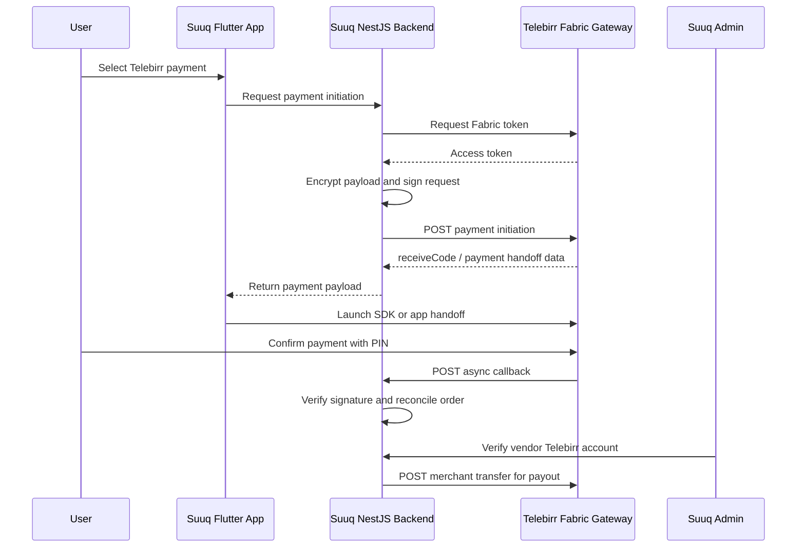

# Software Requirements Specification

for

# Suuq S Telebirr SuperApp SDK Integration

Version 1.2 approved  
Prepared by Ugas Fuad  
Suuq S / Suuq Backend Engineering  
March 27, 2026

**Confidentiality Level:** Confidential / INSA Audit Review Only  
**Primary Deployment Endpoint:** https://api.suuq.ugasfuad.com  
**Production Host Reference:** 134.209.94.162

## Table of Contents

1. Introduction
   1.1 Purpose
   1.2 Document Conventions
   1.3 Intended Audience and Reading Suggestions
   1.4 Product Scope
   1.5 References
2. Overall Description
   2.1 Product Perspective
   2.2 Product Functions
   2.3 User Classes and Characteristics
   2.4 Operating Environment
   2.5 Design and Implementation Constraints
   2.6 User Documentation
   2.7 Assumptions and Dependencies
3. External Interface Requirements
   3.1 User Interfaces
   3.2 Hardware Interfaces
   3.3 Software Interfaces
   3.4 Communications Interfaces
4. System Features
   4.1 Telebirr Payment Initialization and Request Signing
   4.2 Asynchronous Callback Verification and Order Reconciliation
   4.3 Manual and Automatic Status Synchronization
   4.4 Vendor Disbursement and Commission Settlement
   4.5 Vendor Account Verification and Administrative Governance
   4.6 Payment Method Exposure and Operational Gating
5. Other Nonfunctional Requirements
   5.1 Performance Requirements
   5.2 Safety Requirements
   5.3 Security Requirements
   5.4 Software Quality Attributes
   5.5 Business Rules
6. Other Requirements
   Appendix A: Glossary
   Appendix B: Analysis Models
   Appendix C: To Be Determined List

## Revision History

| Name      | Date       | Reason For Changes                                                                                  | Version |
| --------- | ---------- | --------------------------------------------------------------------------------------------------- | ------- |
| Ugas Fuad | 2026-02-06 | Initial security narrative for INSA audit review                                                    | 1.1     |
| Ugas Fuad | 2026-03-27 | Rewritten into full INSA SRS template with detailed functional, interface, and control requirements | 1.2     |

## 1. Introduction

### 1.1 Purpose

This Software Requirements Specification defines the functional, security, interface, and operational requirements for integrating the Telebirr SuperApp payment capability into the Suuq S multi-vendor marketplace platform.

The document covers the payment orchestration scope implemented by the Suuq NestJS backend, the interaction with the Flutter mobile application, the server-to-server interaction with the Ethio Telecom Telebirr Fabric gateway, and the downstream vendor settlement logic used under the Suuq merchant-of-record operating model.

This SRS applies to the Telebirr-related subsystem inside the broader Suuq S commerce platform. It does not attempt to fully specify unrelated marketplace modules such as catalog management, procurement, logistics, or non-Telebirr payment methods except where those modules interface directly with Telebirr payment processing.

### 1.2 Document Conventions

- Section numbering follows the INSA SRS template structure.
- Requirement statements use uppercase normative keywords such as MUST, SHALL, SHOULD, and MAY.
- Functional requirements are uniquely identified using IDs in the form REQ-TB-xxx.
- Nonfunctional requirements are uniquely identified using IDs in the form NFR-TB-xxx.
- API routes, environment variables, entity names, and protocol fields are shown in monospace for precision.
- Unless otherwise stated, all timestamps are UTC and all monetary examples are in Ethiopian Birr (ETB).
- Priority levels are defined as High, Medium, or Low.

### 1.3 Intended Audience and Reading Suggestions

This document is intended for the following readers:

- INSA auditors reviewing security architecture, payment integrity, and control sufficiency.
- Backend engineers implementing or maintaining the Telebirr integration.
- Mobile engineers integrating the Flutter application with backend-issued Telebirr payloads.
- DevOps and infrastructure engineers responsible for production hosting, logging, TLS, and secret management.
- QA and test engineers validating payment flows, callbacks, failure handling, and settlement correctness.
- Product and operations stakeholders responsible for merchant onboarding, payment exception handling, and vendor payout governance.

Recommended reading order:

1. Read Section 1 for scope and terminology.
2. Read Section 2 for the system context and deployment assumptions.
3. Read Section 3 for interfaces and integration boundaries.
4. Read Section 4 for the detailed system behavior.
5. Read Section 5 for security, reliability, and audit expectations.
6. Use the appendices for definitions, models, and open items.

### 1.4 Product Scope

Suuq S is a multi-vendor commerce platform serving retail and marketplace transactions. Within this product, the Telebirr subsystem enables customers to initiate payment through the Telebirr ecosystem while ensuring that the Suuq backend remains the authoritative source of truth for payment status.

The business objectives of this subsystem are:

- enable Ethiopian customers to pay using Telebirr mobile payment rails;
- preserve a merchant-of-record model in which Suuq receives funds first;
- prevent client-side tampering through backend signing and callback verification;
- provide auditable transaction records for order payments, boost purchases, and vendor settlements;
- support regulatory review through explicit control points, logging, and administrative verification of payout identities.

### 1.5 References

| Reference                                        | Description                                                                                                                                                         |
| ------------------------------------------------ | ------------------------------------------------------------------------------------------------------------------------------------------------------------------- |
| Suuq Backend README                              | Project stack, runtime expectations, deployment notes, and supported infrastructure in /root/suuq-backend/README.md                                                 |
| Suuq Backend package.json                        | Build/runtime dependencies and scripts in /root/suuq-backend/package.json                                                                                           |
| Telebirr configuration module                    | Telebirr environment contract in /root/suuq-backend/src/telebirr/telebirr.config.ts                                                                                 |
| Telebirr service implementation                  | Token, signing, encryption, order creation, query, and disbursement logic in /root/suuq-backend/src/telebirr/telebirr.service.ts                                    |
| Payments controller                              | Telebirr initiation, callback, sync, and disbursement endpoints in /root/suuq-backend/src/payments/payments.controller.ts                                           |
| Order entity                                     | Order payment method and status model in /root/suuq-backend/src/orders/entities/order.entity.ts                                                                     |
| Telebirr transaction entity                      | Local audit record for Telebirr transactions in /root/suuq-backend/src/payments/entities/telebirr-transaction.entity.ts                                             |
| User and vendor verification logic               | Telebirr account verification and admin approval flow in /root/suuq-backend/src/users/users.service.ts and /root/suuq-backend/src/admin/vendors.admin.controller.ts |
| Ethio Telecom Telebirr merchant integration pack | Merchant API and SDK specifications supplied through merchant onboarding documentation                                                                              |
| INSA SRS template                                | Standard structure provided by INSA for audit submission                                                                                                            |

## 2. Overall Description

### 2.1 Product Perspective

The Telebirr subsystem is a secure payment integration inside the larger Suuq S marketplace backend. It is not a standalone payment application. It depends on existing Suuq platform modules for orders, products, users, vendor data, wallet and payout handling, and administration.

The product architecture follows a server-signed, client-executed, server-verified pattern:

1. The Flutter mobile application requests payment initiation from the Suuq backend.
2. The backend generates the Telebirr payload, encrypts sensitive fields, signs the request, and requests gateway authorization using a Fabric token.
3. The mobile client launches the Telebirr flow using the backend-produced payment payload.
4. Telebirr sends the final payment status back to the backend callback endpoint.
5. The backend verifies signature validity and updates the authoritative order and transaction state.
6. Where applicable, the backend initiates vendor settlement after successful payment confirmation.

The Telebirr integration shares infrastructure with the broader marketplace and therefore benefits from the existing NestJS application framework, TypeORM persistence layer, audit logging, JWT-based admin authentication, security middleware, and production reverse proxy deployment.

### 2.2 Product Functions

At a high level, the Telebirr subsystem provides these functions:

- generate a Fabric access token and cache it until shortly before expiration;
- create signed and encrypted Telebirr order payloads for marketplace orders and boost purchases;
- receive and verify Telebirr asynchronous callbacks;
- reconcile payment state into local order and transaction records;
- query payment status when callback delivery is delayed or uncertain;
- calculate vendor settlement and platform commission;
- initiate Telebirr merchant transfer disbursements to verified vendor accounts;
- enforce admin approval of vendor Telebirr payout accounts before disbursement;
- expose auditable transaction records and operational status endpoints.

### 2.3 User Classes and Characteristics

| User Class                    | Characteristics                                                                  | Relevant Functions                                                                            |
| ----------------------------- | -------------------------------------------------------------------------------- | --------------------------------------------------------------------------------------------- |
| Customer                      | Marketplace buyer using the Flutter mobile app, typically non-technical          | initiates checkout, confirms payment in Telebirr, polls payment status indirectly through app |
| Vendor                        | Marketplace seller receiving payouts, must supply valid Telebirr account details | receives settlement after successful order payment, subject to account verification           |
| Admin / Super Admin           | Internal privileged operator authenticated through JWT and role-based guards     | verifies vendor Telebirr accounts, reviews transactions, may trigger operational actions      |
| Backend Service               | Automated NestJS service components                                              | token refresh, signing, callback verification, reconciliation, disbursement                   |
| Telebirr Gateway              | External payment processor                                                       | token issuance, payment execution, callback delivery, order query, merchant transfer          |
| Auditor / Compliance Reviewer | Security and regulatory reviewer                                                 | inspects architecture, controls, logs, data flow, and requirement traceability                |

The most critical users from a requirements perspective are customers, admins, backend services, and the external Telebirr gateway.

### 2.4 Operating Environment

The software operates in the following environment:

- Backend runtime: Node.js 20+ on NestJS 11.
- Persistence: PostgreSQL via TypeORM.
- Optional supporting services: Redis for throttling/cache consistency, S3-compatible object storage for unrelated platform assets, Sentry for error reporting, Prometheus-compatible metrics where enabled.
- Server OS: Linux production host behind reverse proxy.
- Network edge: HTTPS termination and reverse proxy, typically Nginx or equivalent.
- Mobile client: Flutter application on Android and iOS, with Telebirr SDK or app handoff capability at the client layer.
- Security middleware: Helmet, request validation, CORS restrictions, compression, and global exception handling.
- Deployment domain: https://api.suuq.ugasfuad.com with API routes under /api.

### 2.5 Design and Implementation Constraints

The implementation is constrained by the following factors:

- Telebirr merchant integration requires valid provisioned credentials: TELEBIRR_APP_ID, TELEBIRR_APP_KEY, TELEBIRR_SHORT_CODE, TELEBIRR_PUBLIC_KEY, TELEBIRR_PRIVATE_KEY, TELEBIRR_NOTIFY_URL, and optionally TELEBIRR_API_URL.
- The backend uses RSA-based signing and public-key encryption consistent with Telebirr gateway expectations.
- The mobile app is not trusted as a payment authority. Final payment confirmation MUST come from backend callback verification or explicit backend query.
- Vendor disbursement is currently modeled as a single-vendor-per-order assumption in the explicit Telebirr disbursement endpoint.
- Some general checkout surfaces in the current codebase gate payment method exposure by country and environment readiness; Ethiopian general checkout currently favors EBIRR and CREDIT even though dedicated Telebirr services and endpoints remain implemented.
- Administrative approval of vendor Telebirr payout accounts is required before settlement.
- The system depends on public HTTPS reachability of the callback endpoint.
- Logging and exception handling must avoid leaking secrets while still preserving sufficient forensic detail.

### 2.6 User Documentation

The following user or operator documentation is relevant to this subsystem:

- Mobile application payment flow documentation for Flutter integration teams.
- Internal operations notes for payment exception handling and vendor account verification.
- Admin SOPs for confirming or rejecting vendor Telebirr payout accounts.
- Deployment and environment documentation maintained in the backend repository README.
- Audit submission package, including this SRS and associated architecture diagrams.

### 2.7 Assumptions and Dependencies

This SRS assumes the following:

- Telebirr merchant onboarding has been completed and production credentials have been issued.
- The Telebirr public key distributed by the provider is authentic and managed securely.
- The Flutter mobile application can either launch the Telebirr SDK or hand off to the Telebirr app using the returned backend payment payload.
- The callback endpoint is reachable from the Telebirr gateway over the public internet.
- The server clock is synchronized closely enough for time-sensitive gateway interactions.
- The production infrastructure protects environment variables and private keys from unauthorized access.
- Marketplace orders that use the direct Telebirr disbursement endpoint contain items from a single vendor, or operational safeguards prevent multi-vendor misuse of that endpoint.
- Post-payment business processing outside the Telebirr-specific explicit callback route may still rely on existing order and wallet services in the broader marketplace system.

## 3. External Interface Requirements

### 3.1 User Interfaces

The subsystem interacts with users through two main interface families.

**Customer mobile interfaces**

- The Flutter application displays payment options and requests available methods from GET /api/payments/methods and GET /api/payments/boost-methods.
- For Telebirr-enabled flows, the app submits a payment initiation request and receives a backend-generated payload such as receiveCode or equivalent payment handoff content.
- The app hands the customer off to the Telebirr app or SDK for PIN confirmation.
- The app MUST treat any client-visible success screen as non-authoritative until backend reconciliation confirms payment.

**Administrative interfaces**

- Admin users verify vendor Telebirr payout accounts through POST /api/admin/vendors/:id/confirm-telebirr.
- Operational users may inspect Telebirr transactions using transaction-listing surfaces and related order state views.
- Error conditions are returned as JSON with explicit failure messages such as invalid signature, order not found, account not verified, or disbursement failed.

No browser-based Telebirr payment page is treated as the authoritative completion interface inside the backend design. Authority resides in server-side verification.

### 3.2 Hardware Interfaces

The subsystem has no specialized hardware interface such as card readers, local PIN pads, or biometric devices. Its hardware dependencies are limited to:

- customer smartphones running the Flutter app and Telebirr application or SDK;
- backend virtual or physical servers hosting the NestJS API;
- network equipment and reverse proxy infrastructure enabling secure HTTPS communication.

### 3.3 Software Interfaces

The subsystem integrates with the following software components.

**Internal software interfaces**

- Order repository and order entity for payment status transitions.
- Product services for boost-payment activation after successful Telebirr payment.
- User entity and user service for vendor payout identity storage and verification status.
- Administrative vendor controller for privileged approval of payout identities.
- Currency formatting service for provider-compatible ETB amount formatting.
- Wallet and payout-related services in the broader platform for downstream financial bookkeeping.
- Security middleware, role guards, and JWT authentication for privileged routes.

**External software interfaces**

- Telebirr Fabric token endpoint: /payment/v1/token
- Telebirr payment initiation endpoint: /payment/v1/toPay
- Telebirr order query endpoint: /payment/v1/queryOrder
- Telebirr merchant transfer endpoint: /payment/v1/merchant/transfer

**Key data items exchanged**

| Data Item               | Direction                                    | Purpose                                          |
| ----------------------- | -------------------------------------------- | ------------------------------------------------ |
| appId                   | Backend to Telebirr                          | identifies the Suuq merchant application         |
| appKey                  | Backend to Telebirr token service            | authenticates token request                      |
| outTradeNo              | Backend to Telebirr and callback correlation | unique Suuq transaction reference                |
| totalAmount             | Backend to Telebirr                          | authoritative server-calculated order amount     |
| notifyUrl               | Backend to Telebirr                          | asynchronous callback destination                |
| sign                    | Backend to Telebirr and Telebirr to backend  | digital signature for integrity and authenticity |
| ussd                    | Backend to Telebirr                          | encrypted business payload                       |
| tradeStatus             | Telebirr to backend                          | final payment state reported by provider         |
| tradeNo / transactionId | Telebirr to backend                          | provider transaction reference                   |

### 3.4 Communications Interfaces

The subsystem uses HTTPS-based API communication with JSON request and response bodies.

- Client-to-backend communication uses HTTPS over REST endpoints exposed under /api.
- Backend-to-Telebirr communication uses HTTPS POST requests and includes the X-Auth-Token header after Fabric token retrieval.
- Backend-to-Telebirr requests use signed request bodies and encrypted payload fields.
- Telebirr-to-backend callback communication uses HTTPS POST to the configured notify URL.
- Internal admin communication uses JWT-authenticated HTTPS APIs with role-based authorization.
- The system SHALL reject or treat as failed any callback that does not pass signature verification.

## 4. System Features

### 4.1 Telebirr Payment Initialization and Request Signing

#### 4.1.1 Description and Priority

This feature generates a Telebirr payment request from an authoritative Suuq order or boost transaction, obtains a Fabric token, encrypts the payment payload, signs the request, and returns the handoff data required by the mobile client. Priority: High.

#### 4.1.2 Stimulus/Response Sequences

1. Customer selects a Telebirr-enabled payment option in the mobile app.
2. Mobile app calls the backend payment initiation endpoint.
3. Backend validates order context and computes the canonical amount.
4. Backend retrieves or reuses a Fabric token.
5. Backend constructs the Telebirr payload including outTradeNo, amount, notifyUrl, timeout, timestamp, and nonce.
6. Backend encrypts the payload and signs the request.
7. Backend sends the signed request to Telebirr.
8. Backend stores a pending local transaction audit record.
9. Backend returns the Telebirr receiveCode or equivalent handoff payload to the mobile app.

Error sequence:

1. If token retrieval fails, the backend returns a payment initiation failure.
2. If the Telebirr gateway rejects the request, the backend marks the local transaction as FAILED and returns an error.
3. If required configuration is missing, the payment method SHALL be considered not ready.

#### 4.1.3 Functional Requirements

- REQ-TB-001: The system MUST generate a unique outTradeNo for every distinct Telebirr payment attempt.
- REQ-TB-002: The system MUST use server-side order or boost pricing data as the authoritative payment amount.
- REQ-TB-003: The system MUST obtain a Fabric token from the Telebirr gateway before calling protected Telebirr payment endpoints.
- REQ-TB-004: The system MUST cache the Fabric token and reuse it until shortly before expiry to reduce unnecessary authentication calls.
- REQ-TB-005: The system MUST encrypt the Telebirr request payload before transmission.
- REQ-TB-006: The system MUST digitally sign outbound Telebirr requests using the configured private key.
- REQ-TB-007: The system MUST include notifyUrl, timestamp, and nonce values in the payment payload.
- REQ-TB-008: The system MUST persist a local pending transaction record before or during payment initiation.
- REQ-TB-009: The system MUST return only backend-generated Telebirr handoff data to the mobile client.
- REQ-TB-010: The system MUST NOT trust client-supplied amount values for Telebirr settlement.

### 4.2 Asynchronous Callback Verification and Order Reconciliation

#### 4.2.1 Description and Priority

This feature receives Telebirr asynchronous payment result callbacks, verifies the signature, updates the transaction audit trail, and reconciles local payment status for orders or boost purchases. Priority: High.

#### 4.2.2 Stimulus/Response Sequences

1. Telebirr posts a payment result to the configured callback endpoint.
2. Backend logs receipt of the callback.
3. Backend verifies the callback signature using the Telebirr public key.
4. Backend retrieves the related local transaction using outTradeNo.
5. Backend stores provider references and raw callback content.
6. Backend branches by transaction type.
7. For boost transactions, the backend activates the requested boost tier after successful status confirmation.
8. For order transactions, the backend updates the order paymentStatus to PAID or FAILED.
9. Backend returns a structured success or failure response.

Invalid callback sequence:

1. Telebirr callback arrives with no valid signature.
2. Backend records the attempt in logs.
3. Backend returns a failure response and MUST NOT update order payment state to PAID.

#### 4.2.3 Functional Requirements

- REQ-TB-011: The system MUST expose a Telebirr callback endpoint reachable over HTTPS.
- REQ-TB-012: The system MUST verify the digital signature on every Telebirr callback before accepting it as authoritative.
- REQ-TB-013: The system MUST reject or mark failed any callback with an invalid or missing signature.
- REQ-TB-014: The system MUST update the matching local Telebirr transaction record with provider transaction identifiers and raw callback payload when available.
- REQ-TB-015: The system MUST map successful Telebirr statuses such as SUCCESS or COMPLETED to local successful payment outcomes.
- REQ-TB-016: The system MUST map non-successful Telebirr statuses to local failed payment outcomes.
- REQ-TB-017: The system MUST reconcile order payments using outTradeNo correlation and local order lookup.
- REQ-TB-018: The system MUST support boost-payment callback processing distinct from marketplace order payment processing.
- REQ-TB-019: The system MUST avoid treating client-side app screens as payment confirmation in place of callback verification.
- REQ-TB-020: The system SHOULD preserve sufficient callback payload detail for operational and audit investigation.

### 4.3 Manual and Automatic Status Synchronization

#### 4.3.1 Description and Priority

This feature lets the backend query Telebirr for payment status when the callback has not yet produced a definitive local state or when clients require an updated order view. Priority: High.

#### 4.3.2 Stimulus/Response Sequences

1. Mobile app or operator requests payment status synchronization for an order.
2. Backend loads the current order and payment state.
3. If the order is already marked PAID, the backend returns success immediately.
4. Otherwise, for Telebirr orders, the backend calls the Telebirr queryOrder endpoint using the existing outTradeNo.
5. If the provider reports a successful state, the backend updates the order payment status to PAID.
6. Backend returns the latest order summary and whether a local update occurred.

#### 4.3.3 Functional Requirements

- REQ-TB-021: The system MUST expose an order payment synchronization endpoint for status reconciliation.
- REQ-TB-022: The system MUST support querying Telebirr by outTradeNo.
- REQ-TB-023: The system MUST update local order payment state when queryOrder returns a successful terminal status.
- REQ-TB-024: The system MUST return a response indicating whether the local state was updated during synchronization.
- REQ-TB-025: The system SHOULD support operational use of synchronization for callback delay or network failure scenarios.
- REQ-TB-026: The system MUST return an error if the requested order does not exist.

### 4.4 Vendor Disbursement and Commission Settlement

#### 4.4.1 Description and Priority

This feature implements the merchant-of-record payout model in which Suuq receives customer funds and subsequently transfers the vendor portion to a verified vendor Telebirr account, retaining the platform commission. Priority: High.

#### 4.4.2 Stimulus/Response Sequences

1. A paid order is selected for vendor disbursement.
2. Backend loads the order and related vendor record.
3. Backend verifies that the order is paid.
4. Backend calculates the commission amount and vendor amount.
5. Backend confirms the vendor has a Telebirr account and that the account has been admin-verified.
6. Backend checks whether a successful disbursement already exists for this order.
7. Backend creates a signed Telebirr merchant transfer request.
8. Backend submits the request to Telebirr.
9. Backend stores a successful disbursement transaction record and returns the result.

Failure sequence:

1. If the vendor account is missing or unverified, the backend refuses disbursement.
2. If the order is unpaid, the backend refuses disbursement.
3. If a successful disbursement already exists, the backend returns an idempotent already-disbursed response.

#### 4.4.3 Functional Requirements

- REQ-TB-027: The system MUST permit vendor disbursement only for orders already marked PAID.
- REQ-TB-028: The system MUST calculate commission and vendor payout deterministically from the authoritative order total.
- REQ-TB-029: The system MUST retain the platform commission and transfer only the vendor share to the vendor payout account.
- REQ-TB-030: The system MUST require a stored vendor Telebirr account before payout initiation.
- REQ-TB-031: The system MUST require that the vendor Telebirr account has been administratively verified before payout initiation.
- REQ-TB-032: The system MUST prevent duplicate successful disbursements for the same order reference.
- REQ-TB-033: The system MUST sign and submit disbursement requests through the Telebirr merchant transfer interface.
- REQ-TB-034: The system MUST store local payout transaction evidence for completed disbursement attempts.
- REQ-TB-035: The system SHOULD support future extension to multi-vendor order settlement orchestration.

### 4.5 Vendor Account Verification and Administrative Governance

#### 4.5.1 Description and Priority

This feature ensures that vendor payout accounts are subject to administrative review before funds can be transferred. Priority: High.

#### 4.5.2 Stimulus/Response Sequences

1. Vendor submits or updates a Telebirr account in profile data.
2. Admin reviews the vendor identity and account details.
3. Admin calls the approval or rejection action.
4. Backend updates the vendor verification fields.
5. Backend stores an audit event including actor identity, target vendor, and decision.
6. Subsequent payout flows enforce the verified state.

#### 4.5.3 Functional Requirements

- REQ-TB-036: The system MUST store a vendor Telebirr account as part of vendor or user payout identity data.
- REQ-TB-037: The system MUST maintain a telebirrVerified boolean state and verification timestamp for each vendor account.
- REQ-TB-038: The system MUST expose an admin-only endpoint for approving or rejecting vendor Telebirr accounts.
- REQ-TB-039: The system MUST protect the verification endpoint using authentication and role-based authorization.
- REQ-TB-040: The system MUST record an audit log entry for each approval or rejection action.
- REQ-TB-041: The system MUST clear or invalidate rejected Telebirr account values so they cannot be used for payout.

### 4.6 Payment Method Exposure and Operational Gating

#### 4.6.1 Description and Priority

This feature exposes only payment methods that are operationally ready for a given country and runtime configuration. Priority: Medium.

#### 4.6.2 Stimulus/Response Sequences

1. Client requests available payment methods.
2. Backend resolves country from request metadata or query.
3. Backend evaluates each payment method against country support and required environment variables.
4. Backend returns only the current method catalog with enabled state.
5. Telebirr is exposed as enabled only if mandatory runtime configuration is present.

#### 4.6.3 Functional Requirements

- REQ-TB-042: The system MUST expose payment method availability through a backend endpoint rather than hard-coding client assumptions.
- REQ-TB-043: The system MUST evaluate Telebirr readiness based on required environment variables.
- REQ-TB-044: The system MUST support country-specific payment method filtering.
- REQ-TB-045: The system SHOULD allow controlled enablement or disablement of payment methods through runtime configuration.
- REQ-TB-046: The system MUST prevent initiation through a Telebirr flow when the provider is not operationally enabled for the requested use case.

## 5. Other Nonfunctional Requirements

### 5.1 Performance Requirements

- NFR-TB-001: Payment initiation SHOULD complete within 500 ms for backend processing exclusive of external mobile confirmation time.
- NFR-TB-002: Fabric token reuse SHOULD minimize repeated token acquisition calls during the token validity window.
- NFR-TB-003: Callback verification and local reconciliation SHOULD complete quickly enough to support near-real-time order confirmation.
- NFR-TB-004: Status synchronization endpoints SHOULD return within acceptable mobile API latency bounds under normal provider response times.

### 5.2 Safety Requirements

Although this is not a physical safety system, financial harm prevention is required.

- NFR-TB-005: The system MUST prevent payout to unverified vendor Telebirr accounts.
- NFR-TB-006: The system MUST prevent duplicate successful disbursement recording for the same order reference.
- NFR-TB-007: The system MUST avoid marking orders as PAID based solely on client-reported success screens.
- NFR-TB-008: Administrative actions affecting payout identities SHOULD be auditable and attributable to named actors.

### 5.3 Security Requirements

- NFR-TB-009: Private keys, app secrets, and merchant credentials MUST be stored server-side in environment variables or an equivalent secure secret store.
- NFR-TB-010: The private key MUST never be exposed to mobile clients, frontend code, or source control.
- NFR-TB-011: All Telebirr callback payloads MUST undergo signature verification before payment acceptance.
- NFR-TB-012: All backend communication with Telebirr MUST use HTTPS.
- NFR-TB-013: The backend MUST apply input validation and reject malformed or incomplete requests.
- NFR-TB-014: Privileged administrative routes MUST require JWT authentication and role-based authorization.
- NFR-TB-015: Logs and monitoring tools SHOULD redact secrets, tokens, and sensitive headers.
- NFR-TB-016: The system SHOULD maintain a durable audit trail of transaction attempts, callbacks, and payout decisions.
- NFR-TB-017: Security middleware such as HTTP header hardening and CORS restrictions MUST remain enabled in production.

### 5.4 Software Quality Attributes

- NFR-TB-018: Availability: The payment subsystem SHOULD remain available during business hours with graceful failure behavior when Telebirr is unreachable.
- NFR-TB-019: Reliability: The system SHOULD tolerate delayed callbacks by providing query-based reconciliation.
- NFR-TB-020: Auditability: Each Telebirr transaction SHOULD be traceable through local references, provider references, timestamps, and stored raw responses.
- NFR-TB-021: Maintainability: Telebirr logic SHOULD remain encapsulated in dedicated configuration and service modules.
- NFR-TB-022: Testability: The subsystem SHOULD allow isolated validation of signing, signature verification, callback handling, and payout guard conditions.
- NFR-TB-023: Observability: Failures in token acquisition, payment initiation, query, callback verification, and disbursement SHOULD generate actionable logs.

### 5.5 Business Rules

- BR-TB-001: Suuq acts as the merchant of record for customer-facing Telebirr payments.
- BR-TB-002: Customer funds are accepted into the Suuq merchant account before vendor payout occurs.
- BR-TB-003: The standard settlement model for the documented flow is 95 percent vendor share and 5 percent platform commission.
- BR-TB-004: A vendor MUST not receive Telebirr payout until an admin has approved the vendor Telebirr account.
- BR-TB-005: Payment success in the client application does not overrule backend verification.
- BR-TB-006: Transaction references MUST remain unique per payment or disbursement attempt.

## 6. Other Requirements

The following additional requirements apply.

- OR-TB-001: The database MUST persist Telebirr transaction audit data including merchant reference, provider reference where available, amount, status, timestamps, and raw response content.
- OR-TB-002: The system SHOULD maintain compatibility with existing marketplace order status and payment status enums.
- OR-TB-003: The callback URL configured in TELEBIRR_NOTIFY_URL MUST resolve to a public HTTPS endpoint under Suuq operational control.
- OR-TB-004: The deployment environment SHOULD include reverse proxy, TLS certificates, process supervision, and centralized log collection.
- OR-TB-005: The mobile application SHOULD apply client-side obfuscation and secure storage practices for SDK-facing logic, while recognizing that payment authority remains server-side.
- OR-TB-006: The system SHOULD support future extension of Telebirr controls to multi-vendor settlement workflows and richer reconciliation tooling.

## Appendix A: Glossary

| Term               | Definition                                                                                 |
| ------------------ | ------------------------------------------------------------------------------------------ |
| Telebirr           | Ethio Telecom mobile payment platform and merchant gateway ecosystem                       |
| Fabric Token       | Provider-issued access token required to access protected Telebirr APIs                    |
| outTradeNo         | Merchant-generated unique transaction reference used for provider correlation              |
| notifyUrl          | Server callback endpoint provided to Telebirr for asynchronous result delivery             |
| Merchant of Record | Business model in which Suuq receives customer funds directly before downstream settlement |
| Callback           | Server-to-server asynchronous notification of payment result                               |
| Disbursement       | Transfer of vendor funds from Suuq to the vendor payout account                            |
| Boost Payment      | Telebirr payment used to purchase promoted placement for a marketplace product             |
| RSA                | Public-key cryptography used here for request signing and payload protection               |
| JWT                | JSON Web Token used for authenticated admin actions                                        |

## Appendix B: Analysis Models

### B.1 Context and Sequence Model

```mermaid
sequenceDiagram
    participant User
    participant App as Suuq Flutter App
    participant Backend as Suuq NestJS Backend
    participant Telebirr as Telebirr Fabric Gateway
    participant Admin as Suuq Admin

    User->>App: Select Telebirr payment
    App->>Backend: Request payment initiation
    Backend->>Telebirr: Request Fabric token
    Telebirr-->>Backend: Access token
    Backend->>Backend: Encrypt payload and sign request
    Backend->>Telebirr: POST payment initiation
    Telebirr-->>Backend: receiveCode / payment handoff data
    Backend-->>App: Return payment payload
    App->>Telebirr: Launch SDK or app handoff
    User->>Telebirr: Confirm payment with PIN
    Telebirr->>Backend: POST async callback
    Backend->>Backend: Verify signature and reconcile order
    Admin->>Backend: Verify vendor Telebirr account
    Backend->>Telebirr: POST merchant transfer for payout
```

### B.2 Data Element Dictionary

| Field Name  | Type             | Source              | Destination             | Description                                 |
| ----------- | ---------------- | ------------------- | ----------------------- | ------------------------------------------- |
| appId       | string           | Backend             | Telebirr                | Telebirr merchant application identifier    |
| appKey      | string           | Backend             | Telebirr token endpoint | Merchant credential used for token issuance |
| shortCode   | string           | Backend             | Telebirr                | Merchant short code                         |
| outTradeNo  | string           | Backend             | Telebirr and callback   | Unique Suuq payment or payout reference     |
| totalAmount | string           | Backend             | Telebirr                | Canonical payment amount                    |
| notifyUrl   | URL              | Backend             | Telebirr                | Asynchronous callback endpoint              |
| ussd        | encrypted string | Backend             | Telebirr                | Encrypted business payload                  |
| sign        | base64 string    | Backend or Telebirr | Peer system             | Request or callback signature               |
| tradeStatus | string           | Telebirr            | Backend                 | Provider-reported transaction outcome       |
| tradeNo     | string           | Telebirr            | Backend                 | Telebirr provider transaction reference     |

### B.3 Local Persistence Model

Primary local persistence objects used in the Telebirr subsystem:

- order: marketplace order carrying paymentMethod, paymentStatus, and operational order status.
- telebirr_transaction: audit table holding merch_order_id, trans_id, payment_order_id, amount, status, raw_response, and timestamps.
- user: vendor profile source for telebirrAccount, telebirrVerified, and telebirrVerifiedAt.

## Appendix C: To Be Determined List

| TBD ID | Item                                                                                                                               | Reason                                                                         |
| ------ | ---------------------------------------------------------------------------------------------------------------------------------- | ------------------------------------------------------------------------------ |
| TBD-01 | Official Telebirr production callback source IP ranges, if allowlist enforcement is mandated in addition to signature verification | Final provider network ranges are not recorded in this repository              |
| TBD-02 | Final retention medium and retention policy for long-term financial API logs used for audit handoff                                | Operational logging platform may vary by deployment                            |
| TBD-03 | Final mobile client iOS-specific obfuscation or hardening standard equivalent to Android ProGuard guidance                         | Mobile client hardening details are maintained outside this backend repository |
